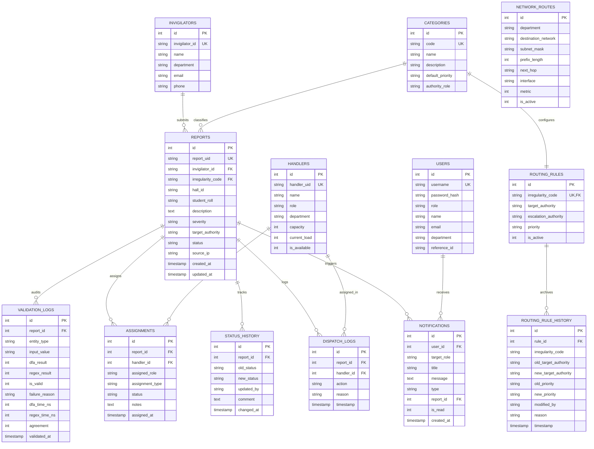

# SQLite Database Entity-Relationship Diagram

IRIS maintains complete transactional integrity and historical accountability across 13 relational tables.

```mermaid
erDiagram
    INVIGILATORS ||--o{ REPORTS : submits
    CATEGORIES ||--o{ REPORTS : classifies
    CATEGORIES ||--|| ROUTING_RULES : configures
    REPORTS ||--o{ VALIDATION_LOGS : audits
    REPORTS ||--o{ ASSIGNMENTS : assigns
    REPORTS ||--o{ STATUS_HISTORY : tracks
    REPORTS ||--o{ DISPATCH_LOGS : logs
    REPORTS ||--o{ NOTIFICATIONS : triggers
    HANDLERS ||--o{ ASSIGNMENTS : handles
    HANDLERS ||--o{ DISPATCH_LOGS : assigned_in
    ROUTING_RULES ||--o{ ROUTING_RULE_HISTORY : archives
    USERS ||--o{ NOTIFICATIONS : receives

    INVIGILATORS {
        int id PK
        string invigilator_id UK
        string name
        string department
        string email
        string phone
    }

    CATEGORIES {
        int id PK
        string code UK
        string name
        string description
        string default_priority
        string authority_role
    }

    ROUTING_RULES {
        int id PK
        string irregularity_code UK, FK
        string target_authority
        string escalation_authority
        string priority
        int is_active
    }

    ROUTING_RULE_HISTORY {
        int id PK
        int rule_id FK
        string irregularity_code
        string old_target_authority
        string new_target_authority
        string old_priority
        string new_priority
        string modified_by
        string reason
        timestamp timestamp
    }

    REPORTS {
        int id PK
        string report_uid UK
        string invigilator_id FK
        string irregularity_code FK
        string hall_id
        string student_roll
        text description
        string severity
        string target_authority
        string status
        string source_ip
        timestamp created_at
        timestamp updated_at
    }

    VALIDATION_LOGS {
        int id PK
        int report_id FK
        string entity_type
        string input_value
        int dfa_result
        int regex_result
        int is_valid
        string failure_reason
        int dfa_time_ns
        int regex_time_ns
        int agreement
        timestamp validated_at
    }

    HANDLERS {
        int id PK
        string handler_uid UK
        string name
        string role
        string department
        int capacity
        int current_load
        int is_available
    }

    ASSIGNMENTS {
        int id PK
        int report_id FK
        int handler_id FK
        string assigned_role
        string assignment_type
        string status
        text notes
        timestamp assigned_at
    }

    STATUS_HISTORY {
        int id PK
        int report_id FK
        string old_status
        string new_status
        string updated_by
        text comment
        timestamp changed_at
    }

    NETWORK_ROUTES {
        int id PK
        string department
        string destination_network
        string subnet_mask
        int prefix_length
        string next_hop
        string interface
        int metric
        int is_active
    }

    DISPATCH_LOGS {
        int id PK
        int report_id FK
        int handler_id FK
        string action
        string reason
        timestamp timestamp
    }

    USERS {
        int id PK
        string username UK
        string password_hash
        string role
        string name
        string email
        string department
        string reference_id
    }

    NOTIFICATIONS {
        int id PK
        int user_id FK
        string target_role
        string title
        text message
        string type
        int report_id FK
        int is_read
        timestamp created_at
    }
```

