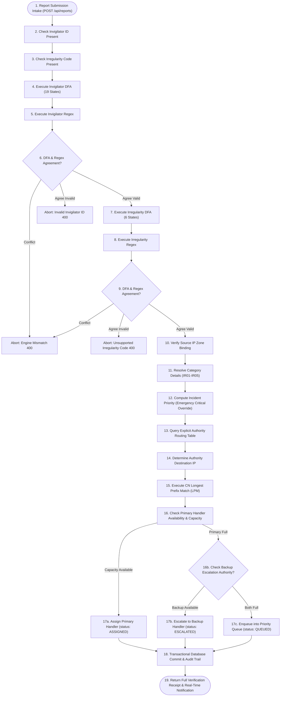

# Examination Incident Lifecycle — 19-Step Processing Pipeline

IRIS processes every submitted examination hall irregularity through an end-to-end, 19-step transactional workflow:

```mermaid
flowchart TD
    Step1(["1. Report Submission Intake (POST /api/reports)"]) --> Step2["2. Check Invigilator ID Present"]
    Step2 --> Step3["3. Check Irregularity Code Present"]
    Step3 --> Step4["4. Execute Invigilator DFA (19 States)"]
    Step4 --> Step5["5. Execute Invigilator Regex"]
    Step5 --> Step6{"6. DFA & Regex Agreement?"}
    
    Step6 -- Conflict --> RejectConflict["Abort: Engine Mismatch 400"]
    Step6 -- Agree Valid --> Step7["7. Execute Irregularity DFA (6 States)"]
    Step6 -- Agree Invalid --> RejectInv["Abort: Invalid Invigilator ID 400"]
    
    Step7 --> Step8["8. Execute Irregularity Regex"]
    Step8 --> Step9{"9. DFA & Regex Agreement?"}
    
    Step9 -- Conflict --> RejectConflict
    Step9 -- Agree Invalid --> RejectIrr["Abort: Unsupported Irregularity Code 400"]
    Step9 -- Agree Valid --> Step10["10. Verify Source IP Zone Binding"]
    
    Step10 --> Step11["11. Resolve Category Details (IR01-IR05)"]
    Step11 --> Step12["12. Compute Incident Priority (Emergency Critical Override)"]
    Step12 --> Step13["13. Query Explicit Authority Routing Table"]
    Step13 --> Step14["14. Determine Authority Destination IP"]
    Step14 --> Step15["15. Execute CN Longest Prefix Match (LPM)"]
    Step15 --> Step16["16. Check Primary Handler Availability & Capacity"]
    
    Step16 -- Capacity Available --> AssignPrimary["17a. Assign Primary Handler (status: ASSIGNED)"]
    Step16 -- Primary Full --> CheckBackup{"16b. Check Backup Escalation Authority?"}
    
    CheckBackup -- Backup Available --> AssignBackup["17b. Escalate to Backup Handler (status: ESCALATED)"]
    CheckBackup -- Both Full --> Enqueue["17c. Enqueue into Priority Queue (status: QUEUED)"]
    
    AssignPrimary --> Step18["18. Transactional Database Commit & Audit Trail"]
    AssignBackup --> Step18
    Enqueue --> Step18
    
    Step18 --> Step19(["19. Return Full Verification Receipt & Real-Time Notification"])
```

